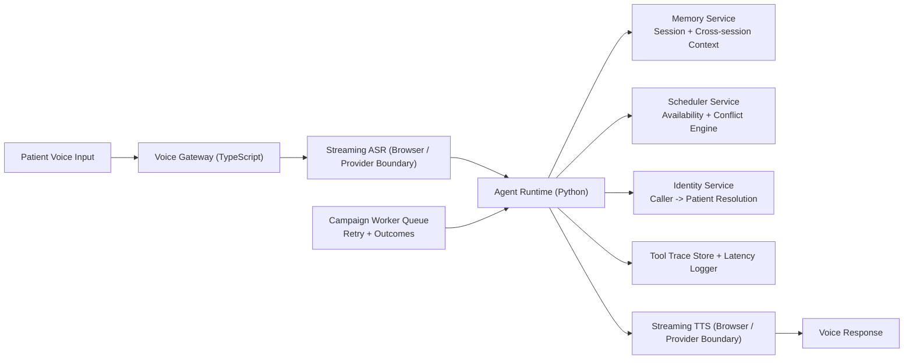

# 2careAI - Real-Time Multilingual Voice Agent (Clinical Appointment Booking)

This repository implements a low-latency voice AI architecture for booking, rescheduling, and cancellation across English, Hindi, and Tamil.

## Tech Stack and Libraries

- Backend: `Python 3` + `FastAPI` + `Uvicorn`
- Frontend gateway/demo: `TypeScript` + `Express` + browser Web Speech APIs (`SpeechRecognition`, `SpeechSynthesis`)
- Memory: in-memory store with optional `Redis` (`redis-py`) for session TTL and persistent patient context
- Data models: `Pydantic`
- Tool orchestration transport: internal HTTP tool calls (`urllib.request`) between agent, memory, scheduler, identity services
- Benchmarking/testing: Python benchmark script + helper tests


## Architecture

- Diagram source: `/Users/khyati/2careAI/docs/architecture.md`
- Runtime components:
  - `apps/voice-gateway-ts`: receives turn payload, forwards to agent, returns trace + latency
  - `services/agent_py`: intent/language handling + tool orchestration
  - `services/scheduler_py`: appointment lifecycle and conflict logic
  - `services/memory_py`: session and patient memory
  - `workers/campaign_py`: outbound campaign trigger loop




## Run Locally

### 1) Install dependencies

```bash
cd /Users/khyati/2careAI
python3 -m venv .venv
source .venv/bin/activate
pip install fastapi uvicorn pydantic redis
npm install
```

### 2) Start backend services (4 terminals)

Terminal A:
```bash
cd /Users/khyati/2careAI
source .venv/bin/activate
uvicorn services.scheduler_py.app.main:app --port 8001
```

Terminal B:
```bash
cd /Users/khyati/2careAI
source .venv/bin/activate
uvicorn services.memory_py.app.main:app --port 8002
```

Terminal C:
```bash
cd /Users/khyati/2careAI
source .venv/bin/activate
uvicorn services.identity_py.app.main:app --port 8003
```

Terminal D:
```bash
cd /Users/khyati/2careAI
source .venv/bin/activate
uvicorn services.agent_py.app.main:app --port 8000
```

### 3) Start gateway (Terminal E)

```bash
npm run dev:gateway
```

### 4)Redis-backed memory with TTL

Start Redis first, then run memory service with:
```bash
export REDIS_URL=redis://127.0.0.1:6379/0
export SESSION_TTL_SECONDS=3600
uvicorn services.memory_py.app.main:app --port 8002
```

### 5) Verify health endpoints

```bash
curl -s http://127.0.0.1:3000/health
curl -s http://127.0.0.1:8000/health
curl -s http://127.0.0.1:8001/health
curl -s http://127.0.0.1:8002/health
curl -s http://127.0.0.1:8003/health
```

### 6) Open browser demo

- Demo UI: `http://127.0.0.1:3000/demo`
- Includes:
- mic input + speech output
- one-click scenario buttons (book, conflict, option select, reschedule, cancel, outbound-decline)
- live trace viewer

### 7) Sample turn (API)

```bash
curl -X POST http://127.0.0.1:3000/voice/turn \
  -H 'Content-Type: application/json' \
  -d '{"callerNumber":"+919900000001","callId":"demo-1","utterance":"book appointment tomorrow morning with dr mehta"}'
```

### 8) Streaming turn simulation (SSE)

```bash
curl -N -X POST http://127.0.0.1:3000/voice/turn/stream \
  -H 'Content-Type: application/json' \
  -d '{"callerNumber":"+919900000001","callId":"demo-stream-1","utterance":"switch to tamil and book appointment tomorrow evening"}'
```

### 9) Outbound campaign simulation

```bash
cd /Users/khyati/2careAI
source .venv/bin/activate
python workers/campaign_py/app/main.py
```

Campaign outcomes are written to:
`/Users/khyati/2careAI/workers/campaign_py/outbound_outcomes.jsonl`

### 10) Latency benchmark

```bash
cd /Users/khyati/2careAI
source .venv/bin/activate
python benchmarks/latency_benchmark.py
```

## Memory Design

- Session memory (`call_id` keyed): current intent, pending fields, active language, `conversation_state`, `pending_confirmation`
- Cross-session memory (`patient_id` keyed): preferred language, interaction notes, historical interaction trail
- Redis-backed memory is supported:
- `REDIS_URL` enables Redis storage
- session memory uses TTL via `SESSION_TTL_SECONDS` (default `3600`)
- patient memory is persisted without TTL for cross-session continuity
- If Redis is unavailable, service falls back to in-memory dictionaries.

Retrieval and prompt integration:
- Agent reads patient + session memory at the start of each turn.
- Retrieved memory directly changes orchestration policy:
- unknown utterance continues prior session intent for multi-turn completion
- stored `appointment_id` and `alternatives_json` drive follow-up execution
- `preferred_language` decides response language continuity across sessions
- Memory summary used for each turn is written into reasoning traces for demonstrability.

## Outbound Campaign Mode

- Campaign worker supports queued jobs, retry, and structured outcome logging.
- Campaigns can trigger reminder/follow-up turns in patient preferred language.
- Response handling includes:
- booking/reschedule/cancel flow detection
- polite rejection classification (`politely_declined`)
- JSONL audit output for campaign analytics and QA
- File: `/Users/khyati/2careAI/workers/campaign_py/outbound_outcomes.jsonl`

## Scheduling and Conflict Logic

- Scheduler validates:
- unavailable doctor (`doctor_unavailable`)
- past-time slot (`past_time`)
- overlap conflict (`slot_conflict`)
- Agent behavior on invalid slots:
- offers up to 3 alternatives
- stores alternatives in session memory
- supports next-turn confirmation via option number (`1/2/3`)
- prevents double booking by re-validating before final booking/reschedule.

## Reasoning Trace Visibility

- Agent stores structured per-turn traces in-memory (bounded ring buffer).
- Trace payload now includes:
- `correlation_id`
- `tool_audit` (tool, status, latency, error)
- `memory_summary` snapshot used at turn-time
- Endpoints:
  - `GET /traces?limit=50`
  - `GET /traces/{call_id}`
- Gateway passthrough:
  - `GET /voice/traces/:callId`
- Demo page includes auto-refreshing "Live Trace Viewer".

## Latency Design Notes

Target: `< 450 ms` speech-end to first audio response.

Current instrumentation logs:
- `memory_read`
- `nlu`
- `orchestration`
- `memory_write`
- `total`
- gateway adds `e2e_estimated`

Next optimization passes:
- streaming ASR partials
- speculative tool prefetch for high-confidence intent
- replace SSE chunking with provider-backed streaming TTS
- Redis latency tuning and connection pooling

