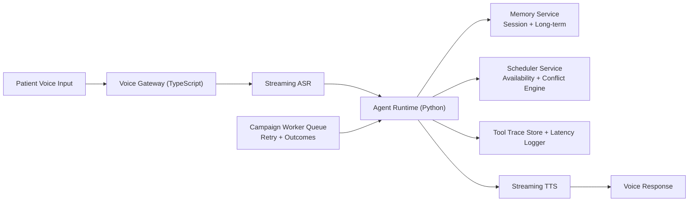

# Real-Time Multilingual Voice AI Agent Architecture

```mermaid
flowchart LR
    A["Patient Voice Input"] --> B["Voice Gateway (TypeScript)"]
    B --> C["Streaming ASR"]
    C --> D["Agent Runtime (Python)"]
    D --> E["Memory Service\nSession + Long-term"]
    D --> F["Scheduler Service\nAvailability + Conflict Engine"]
    D --> G["Tool Trace Store + Latency Logger"]
    D --> H["Streaming TTS"]
    H --> I["Voice Response"]
    J["Campaign Worker Queue\nRetry + Outcomes"] --> D
```
